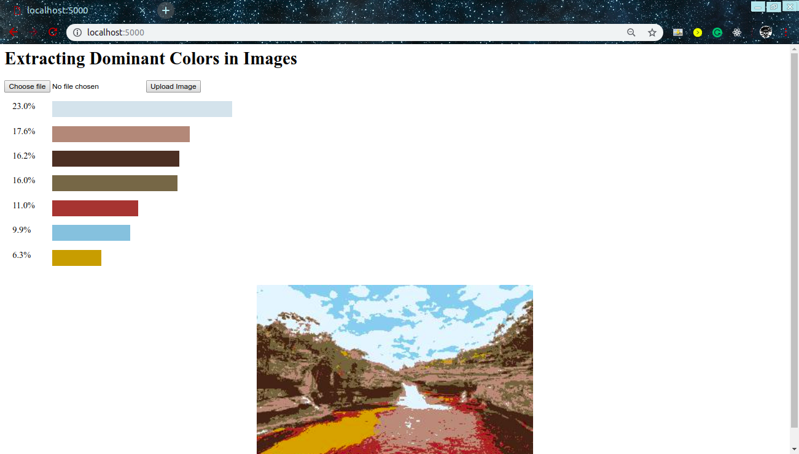

# Extracting-Dominant-Colors
A web application that extracts the dominant colors from an image using K-means clustering.

As the original image may be having too large dimensions, which would result in large number of training examples and thus, slower training; the original image is first resized/compressed and its dimensions are brought down under 500 pixels (so that the number of training examples are ≤2500). The pixels of the compressed image are applied to the K-Nearest Neighbour(KNN) Clustering Algorithm and the top 7 dominant colors are extracted.

Created a web interface for the same using Flask backend, where the user would upload an image and output would be the percentages of different dominant colors in the image, plus, the image masked with just the dominant colors.

<kbd></kbd>

